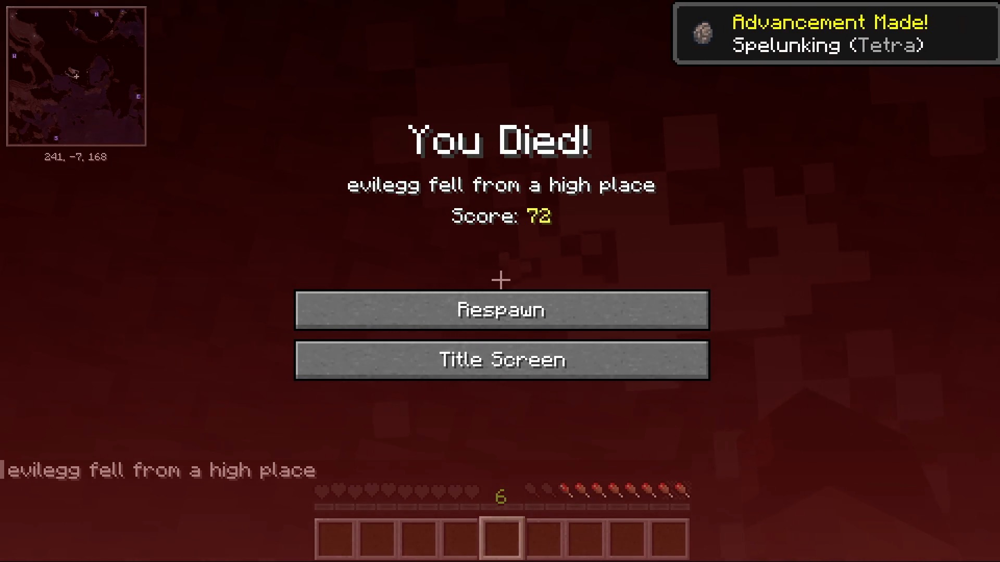

# title_bar

A simple pygame script that adds a transparent overlay over a 1920x1080 thumbnail.
I use this for episode number and title information.

```bash
title_bar.py --title "Title | Sub-title" sample-input.jpg
```



yields:


